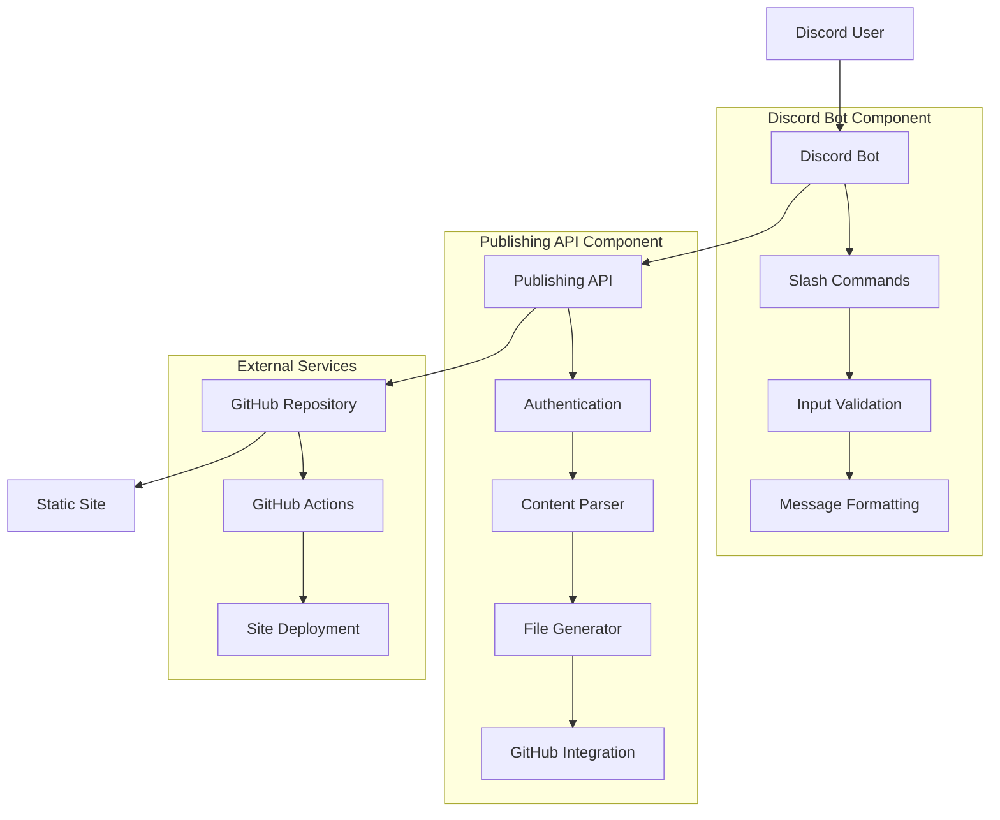

# ADR-001: Discord Publishing Bot Architecture

## Status
**Status:** Accepted  
**Date:** 2025-08-08  
**Decision Makers:** Lead Developer  
**Consulted:** Technical Team  
**Informed:** Project Stakeholders  

## Context

We need to design a system that enables users to publish Discord content to their GitHub-hosted static sites. The system must handle multiple post types (notes, responses, bookmarks, media) while maintaining security, reliability, and ease of use.

### Requirements
- Process Discord slash commands for content publishing
- Generate properly formatted markdown files with YAML frontmatter
- Commit files to GitHub repositories with appropriate organization
- Support four distinct post types with type-specific metadata
- Maintain security through proper authentication
- Scale to handle multiple users and repositories
- Provide reliable service with error handling and monitoring

### Constraints
- Must integrate with existing Discord API and bot infrastructure
- GitHub API rate limits (5000 requests/hour for authenticated requests)
- Static site generators expect specific file formats and frontmatter
- Security requirements for handling user credentials and API keys
- Deployment budget constraints favor serverless or low-cost hosting

## Decision

We will implement a **two-component microservices architecture** consisting of:

1. **Discord Bot Component** (Python + discord.py)
   - Handles Discord slash command registration and processing
   - Validates user input and formats messages
   - Makes API calls to the Publishing API component
   - Provides user feedback and error handling

2. **Publishing API Component** (Python + FastAPI)
   - Processes content and generates formatted markdown files
   - Manages GitHub API integration and file commits
   - Handles authentication and rate limiting
   - Provides health monitoring and logging

### Architecture Diagram



### Technology Stack Selection

**Discord Bot Component:**
- **Language:** Python 3.11+
- **Framework:** discord.py 2.3.x
- **Justification:** Mature Discord integration, excellent async support, strong community

**Publishing API Component:**
- **Language:** Python 3.11+
- **Framework:** FastAPI 0.104.x
- **Justification:** High performance, automatic API documentation, excellent async support

**Shared Dependencies:**
- **GitHub Integration:** PyGithub 1.59.x
- **Configuration:** Pydantic for data validation
- **Logging:** Structured logging with JSON output
- **Testing:** pytest with async support

**Deployment:**
- **Platform:** Fly.io
- **Justification:** Serverless scaling, global edge deployment, cost-effective

## Alternatives Considered

### Alternative 1: Monolithic Architecture
**Description:** Single application handling both Discord and GitHub integration

**Pros:**
- Simpler deployment and development setup
- Reduced network latency between components
- Easier debugging and logging correlation

**Cons:**
- Violates single responsibility principle
- Harder to scale individual components
- Discord bot outages affect GitHub processing
- More complex testing and development

**Decision:** Rejected due to scalability and maintainability concerns

### Alternative 2: Event-Driven Architecture with Message Queue
**Description:** Discord bot publishes events to queue, separate workers process GitHub operations

**Pros:**
- Excellent decoupling and scalability
- Built-in retry and failure handling
- Can handle traffic spikes effectively

**Cons:**
- Increased complexity and operational overhead
- Additional infrastructure costs (Redis/RabbitMQ)
- More complex error handling and user feedback
- Overkill for expected usage volume

**Decision:** Rejected due to complexity vs. benefit trade-off

### Alternative 3: Serverless Functions (AWS Lambda/Vercel)
**Description:** Separate serverless functions for Discord and GitHub operations

**Pros:**
- Automatic scaling and cost optimization
- No server management required
- Built-in monitoring and logging

**Cons:**
- Cold start latency for Discord interactions
- Vendor lock-in concerns
- Complex local development setup
- Limited persistent connection capabilities

**Decision:** Rejected due to Discord bot requirements for persistent connections

### Alternative 4: Self-Hosted on VPS
**Description:** Deploy on traditional virtual private server

**Pros:**
- Full control over environment
- Predictable costs
- No vendor dependencies

**Cons:**
- Server management overhead
- Manual scaling required
- Higher operational complexity
- Single point of failure

**Decision:** Rejected in favor of managed platform benefits

## Implementation Details

### Component Communication
**Protocol:** HTTP/HTTPS REST API  
**Authentication:** Bearer token (API key)  
**Data Format:** JSON with structured error responses  
**Timeout:** 30 seconds with retry logic  

### Data Flow
1. User issues Discord slash command
2. Discord bot validates input and formats message
3. Bot makes authenticated HTTP request to Publishing API
4. API parses content and generates markdown file
5. API commits file to GitHub repository
6. API returns success response with file location
7. Bot provides confirmation to user

### Security Model
**Discord Bot:**
- Discord bot token stored as environment variable
- User permission validation before command processing
- Input sanitization and validation

**Publishing API:**
- API key authentication for all requests
- Discord user ID validation for additional security
- Rate limiting (60 requests/minute per API key)
- GitHub token stored securely with minimal required permissions

### Error Handling Strategy
**Discord Bot:**
- Graceful error messages to users
- Retry logic for temporary API failures
- Fallback to error channels for critical failures

**Publishing API:**
- Structured error responses with error codes
- Comprehensive logging for debugging
- Circuit breaker pattern for GitHub API failures

### Post Type Processing

Each post type has specific frontmatter generation and file organization:

**Notes:** `_src/notes/YYYY-MM-DD-title-slug.md`
```yaml
---
type: note
title: "Post Title"
date: "2025-08-08T10:30:00Z"
slug: "title-slug"
tags: ["tag1", "tag2"]
---
```

**Responses:** `_src/responses/YYYY-MM-DD-response-slug.md`
```yaml
---
type: response
response_type: "reply"
date: "2025-08-08T10:30:00Z"
slug: "response-slug"
in_reply_to: "https://example.com/original"
---
```

**Bookmarks:** `_src/bookmarks/YYYY-MM-DD-bookmark-slug.md`
```yaml
---
type: bookmark
title: "Bookmark Title"
url: "https://example.com"
date: "2025-08-08T10:30:00Z"
slug: "bookmark-slug"
tags: ["tag1", "tag2"]
---
```

**Media:** `posts/media/YYYY-MM-DD-media-slug.md`
```yaml
---
type: media
title: "Media Title"
media_url: "https://example.com/image.jpg"
alt_text: "Description"
date: "2025-08-08T10:30:00Z"
slug: "media-slug"
---
```

## Consequences

### Positive Consequences
- **Separation of Concerns:** Discord and GitHub responsibilities are clearly separated
- **Independent Scaling:** Components can be scaled based on different usage patterns
- **Technology Flexibility:** Can use different technologies for each component
- **Testing Isolation:** Components can be tested independently
- **Fault Isolation:** Discord bot failures don't affect GitHub processing
- **API Reusability:** Publishing API can support other clients beyond Discord

### Negative Consequences
- **Network Latency:** Additional network hop between components
- **Operational Complexity:** Two services to deploy and monitor
- **Distributed Debugging:** Harder to trace issues across service boundaries
- **Development Setup:** More complex local development environment

### Risks and Mitigation Strategies

**Risk: Network Failures Between Components**
- **Mitigation:** Implement retry logic with exponential backoff
- **Monitoring:** Track inter-service communication metrics

**Risk: Component Version Drift**
- **Mitigation:** Synchronized deployment pipelines and versioning
- **Monitoring:** API compatibility testing in CI/CD

**Risk: Authentication Token Management**
- **Mitigation:** Secure token storage and rotation policies
- **Monitoring:** Token expiration alerts and audit logging

## Implementation Plan

### Phase 1: Foundation (Sprint 1)
- Set up development environment and project structure
- Implement basic Discord bot with health check commands
- Create Publishing API skeleton with authentication

### Phase 2: Core Implementation (Sprint 2-3)
- Implement note posting functionality end-to-end
- Add content parsing and GitHub integration
- Implement comprehensive error handling

### Phase 3: Additional Post Types (Sprint 3-4)
- Add support for response, bookmark, and media posts
- Implement advanced features and optimizations
- Add monitoring and observability

### Phase 4: Production Deployment (Sprint 4)
- Deploy to Fly.io with proper configuration
- Set up monitoring and alerting
- Conduct user acceptance testing

## Success Metrics

### Technical Metrics
- **API Response Time:** < 2 seconds (95th percentile)
- **Error Rate:** < 1% of requests
- **Availability:** 99.9% uptime
- **GitHub API Rate Limit:** < 50% utilization

### Business Metrics
- **User Adoption:** Successfully onboard 10+ users
- **Content Volume:** Process 100+ posts per month
- **User Satisfaction:** 4.5+ star rating from users

## References

- [Discord Bot Best Practices](https://discord.com/developers/docs/topics/community-resources)
- [FastAPI Performance Guide](https://fastapi.tiangolo.com/advanced/async-sql-databases/)
- [GitHub API Documentation](https://docs.github.com/en/rest)
- [Microservices Patterns](https://microservices.io/patterns/)
- [Static Site Generator Compatibility](https://jamstack.org/generators/)

## Decision Review

**Next Review Date:** 2025-09-08 (after Phase 2 completion)  
**Review Criteria:**
- Technical debt assessment
- Performance metrics analysis
- User feedback incorporation
- Scalability evaluation

**Potential Revision Triggers:**
- Significant performance issues
- Discord API changes requiring architectural changes
- GitHub API limitations affecting functionality
- User requirements evolution

---

**ADR Version:** 1.0  
**Created By:** Lead Developer  
**Approved By:** Technical Team  
**Implementation Status:** In Progress
