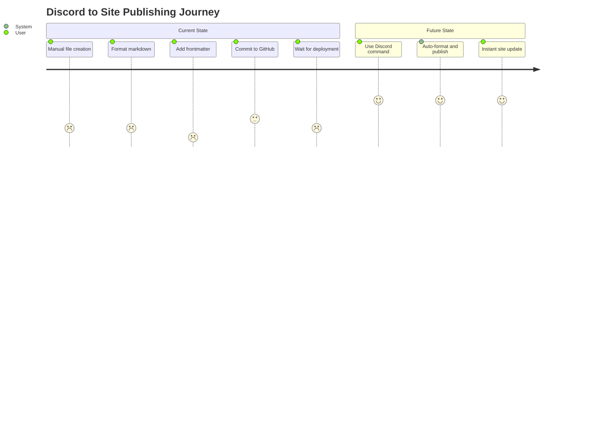
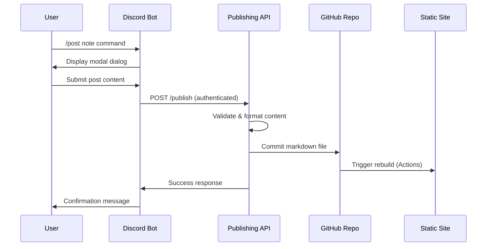

# Discord Post to GitHub Publisher - Product Requirements Document

## Document Information
**Product Name:** Discord Post to GitHub Publisher  
**Product Manager:** [Your Name]  
**Engineering Lead:** [TBD]  
**Document Version:** 1.1  
**Created Date:** 2025-08-08  
**Last Updated:** 2025-08-08  
**Status:** Sprint 1 - Core Implementation Phase  
**Target Release:** Q4 2025

## Executive Summary

### Product Vision
Create a streamlined workflow that enables publishing content from Discord directly to a GitHub-backed static site, supporting multiple post types (notes, responses, bookmarks, media) with automated markdown generation and site deployment.

### Problem Statement
Content creators need an efficient way to publish thoughts, responses, bookmarks, and media from their Discord workspace to their personal static site without manual file creation, formatting, or deployment processes.

### Solution Overview
A two-component system consisting of:
1. **Discord Bot**: Collects user input via slash commands and modal dialogs
2. **Publishing API**: Validates requests, generates markdown with YAML frontmatter, and commits to GitHub repository

### Success Metrics
- **Primary**: Successfully publish 95%+ of Discord posts to static site within 30 seconds
- **Secondary**: Support 4 post types (notes, responses, bookmarks, media) with proper categorization
- **Tertiary**: Zero security incidents with proper user authentication and API key validation

## Market Research and User Needs

### Target User Profile
**Primary User**: Individual content creator/developer
- Uses Discord as primary communication/note-taking platform
- Maintains personal static site (Jekyll, Hugo, Gatsby, etc.)
- Values automation and streamlined workflows
- Technical background sufficient for bot setup and configuration

### User Journey Mapping


### Pain Points Addressed
1. **Manual Process**: Eliminates 5-step manual publishing workflow
2. **Context Switching**: Reduces need to leave Discord environment
3. **Formatting Overhead**: Automates YAML frontmatter and markdown structure
4. **Deployment Delays**: Streamlines GitHub commit and site regeneration

## Functional Requirements

### Core Features

#### F1: Discord Slash Commands
**Priority**: P0 (Critical)  
**User Story**: As a content creator, I want to use Discord slash commands to initiate different post types so I can quickly publish content without leaving my Discord workspace.

**Acceptance Criteria**:
- [ ] `/post note` command opens modal for note creation
- [ ] `/post response` command opens modal for response creation  
- [ ] `/post bookmark` command opens modal for bookmark creation
- [ ] `/post media` command handles attachment-based media posts
- [ ] Commands only respond to authorized Discord User ID
- [ ] All commands provide immediate feedback on success/failure

**Technical Requirements**:
- Discord.py implementation with slash command support
- Modal dialog interfaces for data collection
- User ID validation against environment variable
- Error handling and user feedback systems

#### F2: Content Processing and Formatting
**Priority**: P0 (Critical)  
**User Story**: As a content creator, I want my Discord posts automatically formatted with proper YAML frontmatter and markdown structure so my static site can process them correctly.

**Acceptance Criteria**:
- [ ] Parse post type from Discord command
- [ ] Extract frontmatter fields based on post type
- [ ] Generate markdown with YAML frontmatter header
- [ ] Create SEO-friendly filename slugs
- [ ] Handle special characters and formatting properly

**Technical Requirements**:
- YAML frontmatter generation
- Markdown content processing
- Slug generation algorithm
- Content sanitization and validation

#### F3: GitHub Integration
**Priority**: P0 (Critical)  
**User Story**: As a content creator, I want posts automatically committed to my GitHub repository in the correct folder structure so my static site builds and deploys automatically.

**Acceptance Criteria**:
- [ ] Commit files to appropriate folder based on post type
- [ ] Generate unique filenames with date prefixes
- [ ] Include descriptive commit messages
- [ ] Handle file conflicts and updates appropriately
- [ ] Trigger GitHub Actions for site rebuilding

**Technical Requirements**:
- PyGithub integration for repository operations
- Branch-based commits to specified branch
- Atomic commit operations
- Error handling for GitHub API failures

#### F4: Security and Authentication
**Priority**: P0 (Critical)  
**User Story**: As a system administrator, I want robust authentication and authorization so only authorized users can publish content to my repository.

**Acceptance Criteria**:
- [ ] API key validation on all publishing requests
- [ ] Discord User ID whitelist enforcement
- [ ] HTTPS requirement for API endpoint
- [ ] Fail-fast authentication checks
- [ ] Comprehensive audit logging

**Technical Requirements**:
- Environment variable-based configuration
- Header-based API key authentication
- Request validation middleware
- Security logging and monitoring

### Post Type Specifications

#### Post Type: Notes
**Storage**: `posts/notes/`  
**Required Fields**: 
- Content (markdown)
- Title (optional, derived from content if not provided)

**YAML Frontmatter**:
```yaml
---
type: note
title: "Note Title"
date: "2025-08-08T10:30:00Z"
slug: "note-title-slug"
---
```

#### Post Type: Responses  
**Storage**: `posts/responses/`  
**Required Fields**:
- Response type (reply, like, reshare)
- Response body/content
- Original URL (optional)

**YAML Frontmatter**:
```yaml
---
type: response
response_type: "reply"
date: "2025-08-08T10:30:00Z"
slug: "response-slug"
in_reply_to: "https://example.com/original-post"
---
```

#### Post Type: Bookmarks
**Storage**: `posts/bookmarks/`  
**Required Fields**:
- URL
- Notes (optional)
- Tags (optional)

**YAML Frontmatter**:
```yaml
---
type: bookmark
title: "Bookmarked Page Title"
url: "https://example.com"
date: "2025-08-08T10:30:00Z"
slug: "bookmark-slug"
tags: ["web", "development"]
---
```

#### Post Type: Media
**Storage**: `posts/media/`  
**Required Fields**:
- Media URL or attachment
- Caption/description

**YAML Frontmatter**:
```yaml
---
type: media
title: "Media Caption"
media_url: "https://example.com/image.jpg"
date: "2025-08-08T10:30:00Z"
slug: "media-slug"
alt_text: "Image description"
---
```

## Non-Functional Requirements

### Performance Requirements
- **Response Time**: API requests processed within 5 seconds
- **Throughput**: Support up to 100 posts per day per user
- **Availability**: 99.5% uptime for publishing API
- **GitHub API**: Respect rate limits (5000 requests/hour)

### Security Requirements
- **Authentication**: API key-based authentication for all requests
- **Authorization**: Discord User ID whitelist validation
- **Transport**: HTTPS enforcement for all API communications
- **Data Protection**: No sensitive data logging or storage
- **Environment Variables**: Secure storage of all tokens and keys

### Scalability Requirements
- **Single User**: Designed for individual content creator usage
- **Extension**: Architecture supports multiple user expansion
- **Rate Limiting**: Implement rate limiting for API protection
- **Resource Usage**: Minimal server resource requirements

### Reliability Requirements
- **Error Handling**: Comprehensive error handling with user feedback
- **Rollback**: Ability to manually fix incorrect publications
- **Monitoring**: Health checks and status monitoring
- **Logging**: Comprehensive request and error logging

## Technical Architecture

### System Components

#### Discord Bot (discord.py)
- **Purpose**: User interface and input collection
- **Technology**: Python with discord.py library
- **Deployment**: Long-running process with Discord WebSocket connection
- **Configuration**: Environment variables for tokens and API endpoints

#### Publishing API (FastAPI)
- **Purpose**: Content processing and GitHub integration
- **Technology**: Python with FastAPI framework
- **Deployment**: HTTPS web service (Fly.io, Railway, Render)
- **Configuration**: Environment variables for GitHub and authentication

#### GitHub Repository
- **Purpose**: Content storage and static site source
- **Structure**: Organized folders by post type under `posts/` directory
- **Integration**: GitHub Actions for automated site building

### Data Flow


### API Specification

#### Endpoint: POST /publish
**Authentication**: Header `X-API-Key`  
**Content-Type**: `application/json`

**Request Body**:
```json
{
  "message": "/post note\n---\ntitle: My Note\n---\nThis is **markdown** content.",
  "user_id": "123456789012345678"
}
```

**Success Response** (200):
```json
{
  "status": "success",
  "filepath": "posts/notes/2025-08-08-my-note.md",
  "commit_sha": "abc123...",
  "site_url": "https://yoursite.com/notes/my-note"
}
```

**Error Responses**:
- `401 Unauthorized`: Invalid API key
- `403 Forbidden`: User ID not authorized
- `400 Bad Request`: Invalid message format or content
- `500 Internal Server Error`: GitHub API or processing error

## User Experience Design

### Discord Bot Interface

#### Command Discovery
- Commands appear in Discord's slash command autocomplete
- Help command provides usage instructions
- Error messages include guidance for correction

#### Modal Dialogs
- **Note Modal**: Single text area for markdown content
- **Response Modal**: Dropdown for response type, text area for content, optional URL field
- **Bookmark Modal**: URL field (required), notes field (optional), tags field (optional)
- **Media Posts**: React to message with attachment, bot processes automatically

#### Feedback and Confirmation
- Immediate confirmation message with published URL
- Error messages with actionable guidance
- Status indicators during processing

### Static Site Integration
- Posts appear in appropriate sections based on type
- Consistent URL structure: `/posts/{type}/{slug}`
- RSS/Atom feeds include all post types
- Search functionality includes published content

## Risk Analysis and Mitigation

### Technical Risks

#### Risk: Discord API Rate Limiting
**Probability**: Medium  
**Impact**: Medium  
**Mitigation**: Implement request queuing and exponential backoff

#### Risk: GitHub API Failures
**Probability**: Low  
**Impact**: High  
**Mitigation**: Retry logic, fallback storage, comprehensive error handling

#### Risk: Publishing API Downtime
**Probability**: Medium  
**Impact**: Medium  
**Mitigation**: Health monitoring, multiple deployment regions, status page

### Security Risks

#### Risk: Unauthorized API Access
**Probability**: Medium  
**Impact**: High  
**Mitigation**: Strong API key generation, regular rotation, request logging

#### Risk: Content Injection Attacks
**Probability**: Low  
**Impact**: Medium  
**Mitigation**: Input sanitization, content validation, markdown parsing security

### Operational Risks

#### Risk: Configuration Errors
**Probability**: Medium  
**Impact**: Medium  
**Mitigation**: Environment validation, configuration testing, deployment checklists

## Success Metrics and KPIs

### Primary Success Metrics
1. **Publication Success Rate**: >95% of Discord posts successfully published
2. **Response Time**: <5 seconds from Discord command to site update
3. **User Satisfaction**: Daily usage indicates adoption and value

### Secondary Metrics
1. **Error Rate**: <2% of publishing attempts result in errors
2. **System Uptime**: >99.5% availability for publishing API
3. **Content Quality**: Proper formatting and frontmatter generation >99%

### Monitoring and Analytics
- **Application Performance Monitoring**: Response times, error rates
- **GitHub API Usage**: Rate limit consumption, success rates
- **Discord Bot Health**: WebSocket connection stability, command processing
- **User Behavior**: Command usage patterns, post type distribution

## Implementation Roadmap

### Phase 1: Core Infrastructure ✅ (Weeks 1-2) - COMPLETED
- [x] Set up development environment and repository structure
- [x] Implement basic FastAPI server with authentication
- [x] Create Discord bot with slash command framework
- [x] Establish GitHub integration with PyGithub
- [x] Fix import system compatibility issues
- [x] Resolve environment variable loading conflicts
- [x] Restructure to proper Python entry points
- [x] Repository cleanup and enhanced `.gitignore`

### Phase 2: Basic Publishing (Weeks 3-4) - IN PROGRESS
- [x] Discord bot successfully connecting and running
- [x] GitHub authentication and repository access confirmed
- [ ] Implement note post type with full workflow
- [ ] Add YAML frontmatter generation
- [ ] Create filename slug generation
- [ ] Add comprehensive error handling

### Phase 3: Additional Post Types (Weeks 5-6)
- [ ] Implement response post type
- [ ] Implement bookmark post type
- [ ] Implement media post type with attachment handling
- [ ] Add post type validation and routing

### Phase 4: Polish and Deployment (Weeks 7-8)
- [ ] Deploy publishing API to production environment
- [ ] Configure production Discord bot hosting
- [ ] Add monitoring and health checks
- [ ] Create user documentation and setup guides

### Phase 5: Testing and Launch (Week 9)
- [ ] End-to-end testing with real static site
- [ ] Security review and penetration testing
- [ ] Performance testing and optimization
- [ ] Launch and initial user feedback collection

## Dependencies and Requirements

### External Dependencies
- **Discord Developer Account**: Bot application and token
- **GitHub Repository**: Target repository with Actions enabled
- **Hosting Platform**: HTTPS-capable hosting for FastAPI (Fly.io, Railway, Render)
- **Domain/SSL**: Secure endpoint for API access

### Technical Dependencies
- **Python 3.9+**: For both Discord bot and FastAPI server
- **discord.py**: Discord bot framework
- **FastAPI**: Web API framework
- **PyGithub**: GitHub API integration
- **Static Site Generator**: Jekyll, Hugo, Gatsby, or similar

### Environment Variables
```bash
# Discord Configuration
DISCORD_BOT_TOKEN=your_discord_bot_token
DISCORD_USER_ID=your_discord_user_id

# API Security
API_KEY=generated_secure_api_key
FASTAPI_ENDPOINT=https://your-api.fly.dev

# GitHub Integration
GITHUB_TOKEN=github_personal_access_token
GITHUB_REPO=username/repository-name
GITHUB_BRANCH=main

# Optional
SITE_BASE_URL=https://yoursite.com
```

## Appendices

### Appendix A: Discord Bot Commands Reference
| Command | Description | Modal Fields |
|---------|-------------|--------------|
| `/post note` | Create a note post | Content (markdown) |
| `/post response` | Create a response post | Type, Content, Original URL |
| `/post bookmark` | Create a bookmark | URL, Notes, Tags |
| `/post media` | Create media post | Caption (attachment via reply) |

### Appendix B: File Structure in GitHub Repository
```
posts/
├── notes/
│   └── 2025-08-08-my-note.md
├── responses/
│   └── 2025-08-08-my-response.md
├── bookmarks/
│   └── 2025-08-08-my-bookmark.md
└── media/
    └── 2025-08-08-my-media.md
```

### Appendix C: Example Generated Markdown
```markdown
---
type: note
title: "My Development Note"
date: "2025-08-08T10:30:00Z"
slug: "my-development-note"
tags: ["development", "notes"]
---

This is my **markdown** content with proper formatting.

- List item 1
- List item 2

Code blocks work too:

```python
def hello_world():
    print("Hello, World!")
```

### Appendix D: Security Checklist
- [ ] API key generated with sufficient entropy (32+ characters)
- [ ] HTTPS enforced on all API endpoints
- [ ] Discord User ID properly whitelisted
- [ ] Environment variables secured in deployment
- [ ] GitHub token scoped to minimum required permissions
- [ ] Request logging excludes sensitive data
- [ ] Error responses don't leak internal information

---
*Document Version: 1.0*  
*Status: Active Development*  
*Next Review: 2025-08-15*
