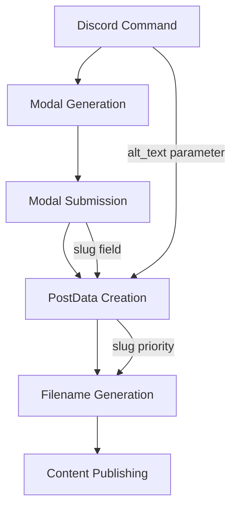
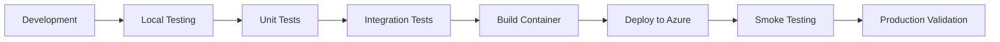

# Technical Specification: Custom Slug and Alt Text Enhancement

## Document Information
**Project:** Discord Publish Bot  
**Version:** 1.0  
**Date:** 2025-09-07  
**Author:** GitHub Copilot  
**Status:** Draft  
**Related PRD:** Custom Slug Enhancement Request  
**Related ADR:** TBD - Will create ADR for alt text parameter approach

## Executive Summary

This specification outlines the implementation of custom slug fields for all post types and improved alt text handling for media posts through command parameters. The enhancement preserves existing functionality while adding user control over URL generation and improving accessibility workflows.

### Key Technical Decisions
- **Slug Field Addition**: Optional slug override for all post types with fallback to auto-generation
- **Alt Text Parameter**: Move alt text from modal field to command parameter for media posts
- **Progressive Enhancement**: Maintain existing user experience while adding advanced capabilities

### Implementation Scope
- Update PostData model with optional slug field
- Enhance filename generation logic with slug priority
- Modify Discord command to include alt_text parameter
- Update all modal implementations for slug field integration
- Preserve existing functionality and backward compatibility
- **Timeline estimate**: 1-2 days implementation + testing
- **Resource requirements**: Single developer, no external dependencies

## Background and Context

### Problem Statement
Users currently cannot control the URL structure of their published content, as slugs are auto-generated from titles. Additionally, alt text entry for media posts requires modal field space that could be better utilized. This limits SEO optimization capabilities and creates suboptimal accessibility workflows.

### Business Requirements
- **User Control**: Enable custom URL slug specification for SEO optimization
- **Accessibility First**: Streamline alt text provision at upload time
- **Space Efficiency**: Maximize modal field utilization within Discord's 5-field limit
- **Backward Compatibility**: Preserve existing auto-generation for users who prefer it

### Technical Context
- **Current Architecture**: Discord bot with modal-based content creation
- **Technology Stack**: Python 3.11+, Discord.py, Pydantic models
- **Constraints**: Discord modal 5-field limit, existing production deployment
- **Dependencies**: No external service changes required

## Technical Requirements

### Functional Requirements

1. **Custom Slug Field**
   - Optional slug input field in all modal types (except media modal space constraint)
   - Slug validation and sanitization using existing `slugify()` function
   - Fallback to title-based auto-generation when slug field is empty
   - Real-time character sanitization (hyphens, lowercase, special char removal)

2. **Alt Text Command Parameter**
   - New `alt_text` optional parameter in `/post` command
   - Parameter only applicable to media post types
   - Alt text passed through to PostData without modal field requirement
   - Validation for reasonable length limits (max 200 characters)

3. **Enhanced Filename Generation**
   - Priority: Custom slug → Auto-generated from title
   - Maintain existing filename format: `{slug}.md`
   - Preserve length limits and character sanitization
   - Ensure uniqueness handling if required

### Non-Functional Requirements

#### Performance
- **Response Time**: No degradation from current <2 second modal response
- **Validation Speed**: Slug sanitization must be instantaneous
- **Resource Usage**: Minimal memory overhead for new fields

#### Security
- **Input Sanitization**: Slug and alt text inputs must be sanitized
- **XSS Prevention**: No script injection through slug or alt text fields
- **Length Limits**: Enforce reasonable character limits on all inputs

#### Reliability
- **Backward Compatibility**: Existing functionality unchanged
- **Fallback Behavior**: Graceful handling when slug field is empty
- **Error Handling**: Clear validation messages for invalid slug inputs

#### Maintainability
- **Code Consistency**: Follow existing patterns and conventions
- **Test Coverage**: Unit tests for new slug generation logic
- **Documentation**: Update relevant documentation and comments

## Solution Architecture

### High-Level Architecture



### System Components

#### Component 1: Command Parameter Enhancement
- **Purpose**: Add alt_text parameter to Discord command
- **Technology**: Discord.py app_commands decorators
- **Interfaces**: Discord slash command interface
- **Dependencies**: Existing command infrastructure

#### Component 2: PostData Model Extension
- **Purpose**: Add slug field to PostData model
- **Technology**: Pydantic BaseModel extension
- **Interfaces**: All modal and service interactions
- **Dependencies**: Existing PostData usage patterns

#### Component 3: Modal Field Integration
- **Purpose**: Add slug input fields to modal types
- **Technology**: Discord.ui.TextInput components
- **Interfaces**: Discord modal interaction system
- **Dependencies**: Existing modal inheritance structure

#### Component 4: Enhanced Filename Generation
- **Purpose**: Implement slug priority in filename generation
- **Technology**: Enhanced utility function
- **Interfaces**: Publishing service integration
- **Dependencies**: Existing slugify utility function

### Data Architecture

#### Enhanced PostData Model
```python
class PostData(BaseModel):
    title: str = Field(..., description="Post title")
    content: str = Field(..., description="Post content/body")
    post_type: PostType = Field(..., description="Type of post")
    tags: Optional[list[str]] = Field(None, description="Post tags")
    slug: Optional[str] = Field(None, description="Custom URL slug override")  # NEW
    
    # Type-specific fields
    target_url: Optional[str] = Field(None, description="URL for responses and bookmarks")
    response_type: Optional[ResponseType] = Field(None, description="Type of response")
    media_url: Optional[str] = Field(None, description="Media URL for media posts")
    media_alt: Optional[str] = Field(None, description="Alt text for media accessibility")
    
    # Metadata
    author: Optional[str] = Field(None, description="Post author")
    created_by: Optional[str] = Field(None, description="Discord user ID")
```

#### Enhanced Command Signature
```python
async def post_command(
    interaction: discord.Interaction, 
    post_type: str, 
    response_type: str = "reply",
    attachment: Optional[discord.Attachment] = None,
    alt_text: Optional[str] = None  # NEW PARAMETER
):
```

### Modal Field Allocation Strategy

#### Note Modal: 4/5 fields ✅
- Title (required)
- Content (required)
- Tags (optional)
- **Custom Slug (optional)** ← NEW

#### Response Modal: 5/5 fields ✅
- Title (required)
- Content (required)
- Tags (optional)
- Target URL (required)
- **Custom Slug (optional)** ← NEW

#### Bookmark Modal: 5/5 fields ✅
- Title (required)
- Content (required)
- Tags (optional)
- Bookmark URL (required)
- **Custom Slug (optional)** ← NEW

#### Media Modal: 5/5 fields ✅
- Title (required)
- Content (required)
- Tags (optional)
- Media URL (optional/pre-filled)
- **Custom Slug (optional)** ← NEW (alt text moved to command parameter)

## Implementation Details

### Development Approach

#### Phase 1: Foundation Changes
- [ ] Update PostData model with slug field
- [ ] Enhance generate_filename() function with slug priority
- [ ] Add alt_text parameter to command signature
- [ ] Create unit tests for slug generation logic
- **Timeline**: 4-6 hours

#### Phase 2: Modal Integration
- [ ] Add slug input field to NoteModal
- [ ] Add slug input field to ResponseModal  
- [ ] Add slug input field to BookmarkModal
- [ ] Update MediaModal to use command alt_text
- [ ] Remove alt_text input field from MediaModal
- **Timeline**: 4-6 hours

#### Phase 3: Integration & Testing
- [ ] Update interactions.py HTTP handler
- [ ] Test all modal types with slug field
- [ ] Validate alt_text parameter handling
- [ ] End-to-end testing of filename generation
- [ ] Production deployment validation
- **Timeline**: 4-6 hours

### Technology Stack

#### Backend Implementation
- **Language**: Python 3.11+
- **Discord Library**: discord.py with app_commands
- **Validation**: Pydantic BaseModel
- **Utilities**: Existing slugify function

#### Key Code Changes

##### Enhanced Filename Generation
```python
def generate_filename(
    post_type: PostType, 
    title: str, 
    slug: Optional[str] = None,
    timestamp: Optional[datetime] = None
) -> str:
    """
    Generate filename for post with slug priority.
    
    Args:
        post_type: Type of post
        title: Post title
        slug: Optional custom slug (takes priority)
        timestamp: Optional timestamp (maintained for compatibility)
        
    Returns:
        Generated filename with .md extension
    """
    if slug and slug.strip():
        # Use custom slug if provided
        filename_slug = slugify(slug.strip(), max_length=80)
    else:
        # Fall back to title-based generation
        filename_slug = slugify(title, max_length=80)
    
    return f"{filename_slug}.md"
```

##### Modal Slug Field Integration
```python
class BasePostModal(discord.ui.Modal):
    def __init__(self, bot: DiscordBot, post_type: PostType):
        super().__init__(title=f"Create {post_type.value.title()} Post")
        self.bot = bot
        self.post_type = post_type
        
        # Common fields (existing)
        self.title_input = discord.ui.TextInput(...)
        self.content_input = discord.ui.TextInput(...)
        self.tags_input = discord.ui.TextInput(...)
        
        # NEW: Custom slug field
        self.slug_input = discord.ui.TextInput(
            label="Custom Slug (optional)",
            placeholder="Leave blank to auto-generate from title",
            max_length=80,
            required=False
        )
        self.add_item(self.slug_input)
```

##### Command Parameter Addition
```python
@app_commands.describe(
    post_type="Type of post to create",
    response_type="Type of response (only for response posts)",
    attachment="Upload a file for media posts (optional)",
    alt_text="Alt text for accessibility (media posts only)"  # NEW
)
async def post_command(
    interaction: discord.Interaction, 
    post_type: str, 
    response_type: str = "reply",
    attachment: Optional[discord.Attachment] = None,
    alt_text: Optional[str] = None  # NEW
):
```

## Testing Strategy

### Test Coverage Areas

#### Unit Tests
- **Slug Priority Logic**: Test generate_filename() with various slug/title combinations
- **Sanitization**: Validate slugify behavior with special characters
- **Fallback Behavior**: Ensure proper fallback when slug is empty/None
- **Length Handling**: Test behavior with very long slugs

#### Integration Tests
- **Modal Creation**: Test all modal types with slug fields
- **PostData Population**: Verify slug field propagation through system
- **Command Parameter**: Test alt_text parameter handling for media posts
- **Backward Compatibility**: Ensure existing functionality unchanged

#### End-to-End Tests
- **Complete Workflows**: Test full post creation with custom slugs
- **Alt Text Flow**: Validate media post creation with command alt_text
- **Mixed Scenarios**: Test combinations of slug/no-slug with various post types

### Test Scenarios

```python
def test_slug_priority():
    """Test that custom slug takes priority over title-based generation."""
    filename = generate_filename(
        post_type=PostType.NOTE,
        title="This is a Very Long Title That Would Generate a Long Slug",
        slug="custom-short-slug"
    )
    assert filename == "custom-short-slug.md"

def test_slug_fallback():
    """Test fallback to title when slug is empty."""
    filename = generate_filename(
        post_type=PostType.NOTE,
        title="Test Title",
        slug=""  # Empty slug should trigger fallback
    )
    assert filename == "test-title.md"

def test_slug_sanitization():
    """Test that slug is properly sanitized."""
    filename = generate_filename(
        post_type=PostType.NOTE,
        title="Test Title",
        slug="Custom Slug with Spaces & Special Characters!"
    )
    assert filename == "custom-slug-with-spaces-special-characters.md"
```

## Risk Assessment and Mitigation

### Technical Risks

#### High Priority Risks
- **Risk**: Discord modal field limit exceeded causing modal failures
  - **Impact**: Complete loss of functionality for affected modal types
  - **Probability**: Low (carefully planned field allocation)
  - **Mitigation**: Thorough testing of field counts, alt text moved to command parameter
  - **Contingency**: Rollback deployment, implement two-stage modal if needed

- **Risk**: Slug conflicts or invalid slugs causing publishing failures
  - **Impact**: User frustration, failed content creation
  - **Probability**: Medium (user input validation challenge)
  - **Mitigation**: Comprehensive input sanitization, fallback to title-based generation
  - **Contingency**: Enhanced error messages, suggestion system for invalid slugs

#### Medium Priority Risks
- **Risk**: Alt text parameter not intuitive for users
  - **Impact**: Reduced accessibility compliance
  - **Mitigation**: Clear parameter description, optional nature preserved
  - **Contingency**: Add back to modal if user feedback negative

- **Risk**: Existing users confused by new slug field
  - **Impact**: User experience degradation
  - **Mitigation**: Field marked as optional with clear placeholder text
  - **Contingency**: Enhanced documentation, user guidance

### Dependencies and External Risks
- **Discord API**: No additional Discord API dependencies
- **Infrastructure**: No infrastructure changes required
- **Team Dependencies**: Single developer implementation, minimal coordination needed

## Deployment Strategy

### Deployment Pipeline


### Implementation Steps

1. **Phase 1 Implementation**
   - Update models and utilities
   - Implement enhanced filename generation
   - Add comprehensive unit tests
   - Validate local functionality

2. **Phase 2 Implementation**
   - Update all modal classes
   - Add command parameter
   - Update interactions.py handler
   - Integration testing

3. **Phase 3 Deployment**
   - Build and deploy to Azure Container Apps
   - Validate Discord command registration
   - Test all post type workflows
   - Monitor for errors or user feedback

### Rollback Plan
- **Immediate Rollback**: Revert to previous container image if critical issues
- **Partial Rollback**: Disable slug field validation if slug-specific issues
- **Data Safety**: No data migration required, new fields optional

## Monitoring and Observability

### Success Metrics
- **Slug Usage Rate**: Percentage of posts using custom slugs vs auto-generated
- **Alt Text Provision**: Increase in alt text provision for media posts
- **Error Rates**: No increase in post creation failures
- **User Feedback**: Positive reception of enhanced control

### Monitoring Points
- **Modal Submission Errors**: Track failures related to new fields
- **Slug Generation Failures**: Monitor fallback usage and sanitization issues
- **Parameter Usage**: Track alt_text parameter utilization
- **Performance Impact**: Ensure no degradation in response times

## Conclusion

This enhancement provides significant value to users by enabling URL control and improving accessibility workflows while maintaining full backward compatibility. The implementation is low-risk due to optional field design and comprehensive fallback mechanisms.

The alt text command parameter approach is particularly elegant, solving the modal space constraint while encouraging better accessibility practices by prompting for alt text at upload time rather than as an afterthought.

**Recommendation**: Proceed with implementation following the phased approach outlined above.

---
*Template Version: 1.0*  
*Last Updated: 2025-09-07*  
*Next Review: Post-implementation (2025-09-14)*
