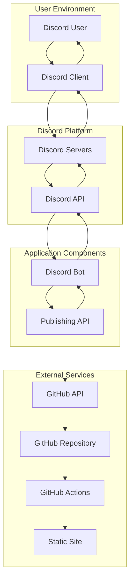
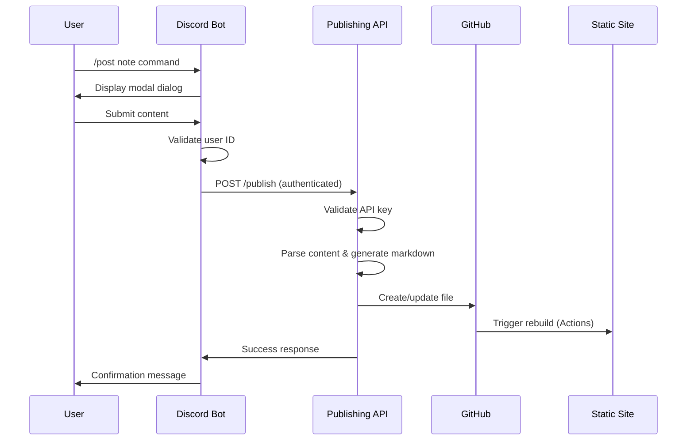
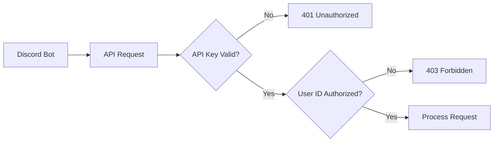

# Discord Post to GitHub Publisher - Technical Specification

## Document Information
**Project:** Discord Post to GitHub Publisher  
**Technical Lead:** [TBD]  
**Document Version:** 1.0  
**Created Date:** 2025-08-08  
**Last Updated:** 2025-08-08  
**Status:** Active Development  
**Implementation Target:** Q4 2025

## Executive Summary

This document defines the technical implementation for a Discord bot and FastAPI publishing system that automates content publishing from Discord to GitHub-backed static sites. The system processes four post types (notes, responses, bookmarks, media) with YAML frontmatter generation and automated repository commits.

### Architecture Overview
- **Discord Bot**: Python discord.py application with slash commands and modal interfaces
- **Publishing API**: FastAPI server with GitHub integration and content processing
- **GitHub Integration**: PyGithub-based repository operations with automated site deployment

### Key Technical Decisions
- **Language**: Python 3.9+ for both components (ecosystem compatibility)
- **Framework**: FastAPI for API server (performance, async support, OpenAPI)
- **Authentication**: API key + Discord User ID validation (security)
- **Deployment**: Containerized deployment with environment-based configuration

## Requirements Overview

### Functional Requirements Summary
1. **Discord Interface**: Slash commands with modal dialogs for content input
2. **Content Processing**: YAML frontmatter generation with markdown formatting
3. **GitHub Integration**: Automated commits with proper folder organization
4. **Security**: API key authentication with user ID validation
5. **Error Handling**: Comprehensive error handling with user feedback

### Non-Functional Requirements Summary
- **Performance**: <5 second response time for publishing requests
- **Reliability**: 99.5% uptime with comprehensive error handling
- **Security**: HTTPS-only API with environment-based secrets
- **Scalability**: Single-user focused with multi-user expansion capability

## Solution Architecture

### System Architecture Diagram


### Component Interaction Flow


### Data Flow Architecture


## Detailed Component Design

### Discord Bot Component

#### Technology Stack
- **Framework**: discord.py 2.3+
- **Python Version**: 3.9+
- **Dependencies**: aiohttp, python-dotenv
- **Deployment**: Long-running process with PM2 or systemd

#### Architecture
```python
# Main bot structure
class DiscordPublishBot:
    def __init__(self, token: str, api_config: dict):
        self.bot = commands.Bot(command_prefix='/', intents=intents)
        self.api_config = api_config
        self.authorized_user_id = os.getenv("DISCORD_USER_ID")
    
    async def setup_commands(self):
        # Register slash commands and modal handlers
        pass
    
    def run(self):
        self.bot.run(self.token)
```

#### Slash Commands Implementation
```python
@app_commands.command(name="post")
@app_commands.describe(post_type="Type of post to create")
@app_commands.choices(post_type=[
    app_commands.Choice(name="note", value="note"),
    app_commands.Choice(name="response", value="response"),
    app_commands.Choice(name="bookmark", value="bookmark"),
    app_commands.Choice(name="media", value="media")
])
async def post_command(interaction: discord.Interaction, post_type: str):
    # Validate user authorization
    if str(interaction.user.id) != self.authorized_user_id:
        await interaction.response.send_message("Unauthorized", ephemeral=True)
        return
    
    # Route to appropriate modal based on post_type
    modal = create_modal_for_post_type(post_type)
    await interaction.response.send_modal(modal)
```

#### Modal Dialog Implementations
```python
class NoteModal(discord.ui.Modal, title="Create Note Post"):
    content = discord.ui.TextInput(
        label="Content (Markdown)",
        style=discord.TextStyle.paragraph,
        placeholder="Enter your note content...",
        required=True,
        max_length=2000
    )
    
    title = discord.ui.TextInput(
        label="Title (Optional)",
        style=discord.TextStyle.short,
        placeholder="Auto-generated if not provided",
        required=False,
        max_length=100
    )
    
    async def on_submit(self, interaction: discord.Interaction):
        post_data = {
            "message": f"/post note\n---\ntitle: {self.title.value}\n---\n{self.content.value}",
            "user_id": str(interaction.user.id)
        }
        
        # Send to publishing API
        success, response = await send_to_api(post_data)
        
        if success:
            await interaction.response.send_message(
                f"✅ Note published: {response.get('filepath')}",
                ephemeral=True
            )
        else:
            await interaction.response.send_message(
                f"❌ Error: {response.get('error', 'Unknown error')}",
                ephemeral=True
            )
```

### Publishing API Component

#### Technology Stack
- **Framework**: FastAPI 0.104+
- **Python Version**: 3.9+
- **Dependencies**: PyGithub, python-multipart, pydantic, uvicorn
- **Deployment**: Container-based (Docker) on Fly.io/Railway/Render

#### API Architecture
```python
from fastapi import FastAPI, HTTPException, Header, Depends
from pydantic import BaseModel
import os
from datetime import datetime
from github import Github

app = FastAPI(title="Discord Publishing API", version="1.0.0")

class PublishRequest(BaseModel):
    message: str
    user_id: str

class PublishResponse(BaseModel):
    status: str
    filepath: str
    commit_sha: str = None
    site_url: str = None

# Configuration
API_KEY = os.getenv("API_KEY")
DISCORD_USER_ID = os.getenv("DISCORD_USER_ID")
GITHUB_TOKEN = os.getenv("GITHUB_TOKEN")
GITHUB_REPO = os.getenv("GITHUB_REPO")
GITHUB_BRANCH = os.getenv("GITHUB_BRANCH", "main")
SITE_BASE_URL = os.getenv("SITE_BASE_URL")
```

#### Authentication Middleware
```python
async def verify_api_key(x_api_key: str = Header(None)):
    if x_api_key != API_KEY:
        raise HTTPException(status_code=401, detail="Invalid API key")
    return x_api_key

async def verify_user_id(request: PublishRequest):
    if request.user_id != DISCORD_USER_ID:
        raise HTTPException(status_code=403, detail="Unauthorized user")
    return request
```

#### Core Publishing Endpoint
```python
@app.post("/publish", response_model=PublishResponse)
async def publish_post(
    request: PublishRequest,
    api_key: str = Depends(verify_api_key),
    validated_request: PublishRequest = Depends(verify_user_id)
):
    try:
        # Parse message content
        post_type, frontmatter, content = parse_discord_message(request.message)
        
        # Generate markdown file
        markdown_content = build_markdown_file(frontmatter, content)
        
        # Generate filename
        filename = generate_filename(post_type, frontmatter, content)
        filepath = f"posts/{POST_TYPE_FOLDERS[post_type]}/{filename}"
        
        # Commit to GitHub
        commit_sha = commit_to_github(filepath, markdown_content, post_type, request.user_id)
        
        # Build response
        site_url = f"{SITE_BASE_URL}/posts/{POST_TYPE_FOLDERS[post_type]}/{filename.replace('.md', '')}" if SITE_BASE_URL else None
        
        return PublishResponse(
            status="success",
            filepath=filepath,
            commit_sha=commit_sha,
            site_url=site_url
        )
        
    except Exception as e:
        logger.error(f"Publishing error: {str(e)}")
        raise HTTPException(status_code=500, detail=f"Publishing failed: {str(e)}")
```

### Content Processing Engine

#### Message Parsing
```python
def parse_discord_message(message: str) -> tuple[str, dict, str]:
    """
    Parse Discord message into post type, frontmatter, and content.
    
    Returns:
        tuple: (post_type, frontmatter_dict, content_string)
    """
    lines = message.strip().split('\n')
    
    # Extract post type from first line
    command_line = lines[0]
    post_type = command_line.split()[1] if len(command_line.split()) > 1 else "note"
    
    # Parse frontmatter if present
    frontmatter = {}
    content_start = 1
    
    if len(lines) > 1 and lines[1] == "---":
        # Find end of frontmatter
        for i, line in enumerate(lines[2:], start=2):
            if line == "---":
                content_start = i + 1
                break
            if ":" in line:
                key, value = line.split(":", 1)
                frontmatter[key.strip()] = value.strip()
    
    # Extract content
    content = '\n'.join(lines[content_start:]).strip()
    
    # Add default frontmatter
    frontmatter.update({
        "type": post_type,
        "date": datetime.utcnow().isoformat() + "Z",
        "slug": generate_slug(content)
    })
    
    return post_type, frontmatter, content
```

#### Markdown File Generation
```python
import yaml

def build_markdown_file(frontmatter: dict, content: str) -> str:
    """
    Build complete markdown file with YAML frontmatter.
    """
    # Ensure required frontmatter fields
    if "title" not in frontmatter and content:
        # Generate title from first line of content
        first_line = content.strip().split('\n')[0]
        frontmatter["title"] = first_line[:50].strip()
    
    # Generate YAML frontmatter
    yaml_content = yaml.safe_dump(frontmatter, sort_keys=False, allow_unicode=True)
    
    # Combine frontmatter and content
    return f"---\n{yaml_content}---\n\n{content}"

def generate_slug(content: str) -> str:
    """
    Generate URL-friendly slug from content.
    """
    import re
    
    # Take first 30 characters of content
    snippet = content.strip().split('\n')[0][:30].lower()
    
    # Clean and format
    slug = re.sub(r'[^a-z0-9\-\s]', '', snippet)
    slug = re.sub(r'\s+', '-', slug.strip())
    slug = re.sub(r'-+', '-', slug)
    
    return slug or "untitled"

def generate_filename(post_type: str, frontmatter: dict, content: str) -> str:
    """
    Generate filename with date prefix and slug.
    """
    date_str = datetime.utcnow().strftime("%Y-%m-%d")
    slug = frontmatter.get("slug", generate_slug(content))
    
    return f"{date_str}-{slug}.md"
```

### GitHub Integration

#### Repository Operations
```python
from github import Github
from github.GithubException import GithubException

def commit_to_github(filepath: str, content: str, post_type: str, user_id: str) -> str:
    """
    Commit file to GitHub repository.
    
    Returns:
        str: Commit SHA
    """
    try:
        g = Github(GITHUB_TOKEN)
        repo = g.get_repo(GITHUB_REPO)
        
        commit_message = f"Add {post_type} post from Discord user {user_id}"
        
        # Check if file exists
        try:
            existing_file = repo.get_contents(filepath, ref=GITHUB_BRANCH)
            # Update existing file
            commit = repo.update_file(
                path=filepath,
                message=commit_message,
                content=content,
                sha=existing_file.sha,
                branch=GITHUB_BRANCH
            )
        except GithubException as e:
            if e.status == 404:
                # Create new file
                commit = repo.create_file(
                    path=filepath,
                    message=commit_message,
                    content=content,
                    branch=GITHUB_BRANCH
                )
            else:
                raise
        
        return commit['commit'].sha
        
    except Exception as e:
        logger.error(f"GitHub commit error: {str(e)}")
        raise Exception(f"Failed to commit to GitHub: {str(e)}")
```

## API Design

### OpenAPI Specification
```yaml
openapi: 3.0.0
info:
  title: Discord Publishing API
  description: API for publishing Discord posts to GitHub repository
  version: 1.0.0
  
servers:
  - url: https://discord-publish-api.fly.dev
    description: Production server

paths:
  /publish:
    post:
      summary: Publish a Discord post to GitHub
      security:
        - ApiKeyAuth: []
      requestBody:
        required: true
        content:
          application/json:
            schema:
              $ref: '#/components/schemas/PublishRequest'
      responses:
        '200':
          description: Post published successfully
          content:
            application/json:
              schema:
                $ref: '#/components/schemas/PublishResponse'
        '400':
          description: Invalid request format
        '401':
          description: Invalid API key
        '403':
          description: Unauthorized user
        '500':
          description: Server error

  /health:
    get:
      summary: Health check endpoint
      responses:
        '200':
          description: Service is healthy

components:
  schemas:
    PublishRequest:
      type: object
      required:
        - message
        - user_id
      properties:
        message:
          type: string
          description: Discord command message with content
        user_id:
          type: string
          description: Discord user ID
          
    PublishResponse:
      type: object
      properties:
        status:
          type: string
          enum: [success, error]
        filepath:
          type: string
          description: Path to created file in repository
        commit_sha:
          type: string
          description: GitHub commit SHA
        site_url:
          type: string
          description: URL to published post on static site
          
  securitySchemes:
    ApiKeyAuth:
      type: apiKey
      in: header
      name: X-API-Key
```

### Error Handling Strategy
```python
from fastapi import HTTPException
from fastapi.responses import JSONResponse
from fastapi.requests import Request
import logging

logger = logging.getLogger(__name__)

@app.exception_handler(HTTPException)
async def http_exception_handler(request: Request, exc: HTTPException):
    return JSONResponse(
        status_code=exc.status_code,
        content={
            "error": {
                "code": exc.status_code,
                "message": exc.detail,
                "type": "http_exception"
            }
        }
    )

@app.exception_handler(Exception)
async def general_exception_handler(request: Request, exc: Exception):
    logger.error(f"Unhandled exception: {str(exc)}", exc_info=True)
    return JSONResponse(
        status_code=500,
        content={
            "error": {
                "code": 500,
                "message": "Internal server error",
                "type": "server_error"
            }
        }
    )
```

## Database Design

### Data Storage Strategy
This system is designed to be stateless with no persistent database requirements. All data flows through the system and is stored in the GitHub repository as markdown files.

### Configuration Storage
Environment variables handle all configuration:

```bash
# Discord Configuration
DISCORD_BOT_TOKEN=your_discord_bot_token
DISCORD_USER_ID=your_discord_user_id

# API Security
API_KEY=generated_secure_api_key
FASTAPI_ENDPOINT=https://your-api.fly.dev

# GitHub Integration
GITHUB_TOKEN=github_personal_access_token
GITHUB_REPO=username/repository-name
GITHUB_BRANCH=main

# Optional Configuration
SITE_BASE_URL=https://yoursite.com
LOG_LEVEL=INFO
```

### File Structure in Repository
```
_src/
├── notes/
│   ├── 2025-08-08-my-first-note.md
│   ├── 2025-08-08-development-thoughts.md
│   └── 2025-08-09-project-update.md
├── responses/
│   ├── 2025-08-08-reply-to-post.md
│   └── 2025-08-09-like-response.md
├── bookmarks/
│   ├── 2025-08-08-useful-article.md
│   └── 2025-08-09-development-tool.md
└── media/
    ├── 2025-08-08-screenshot.md
    └── 2025-08-09-diagram.md
```

## Security Design

### Authentication Architecture


### Security Implementation
```python
# Environment-based secrets
API_KEY = os.getenv("API_KEY")  # 32+ character random string
DISCORD_USER_ID = os.getenv("DISCORD_USER_ID")  # Your Discord user ID
GITHUB_TOKEN = os.getenv("GITHUB_TOKEN")  # GitHub PAT with repo scope

# Request validation
def validate_request_security(api_key: str, user_id: str) -> bool:
    """Validate API key and user authorization."""
    if not api_key or api_key != API_KEY:
        return False
    
    if not user_id or user_id != DISCORD_USER_ID:
        return False
        
    return True

# Content sanitization
def sanitize_content(content: str) -> str:
    """Sanitize user input to prevent injection attacks."""
    # Remove potentially dangerous characters
    import html
    import re
    
    # HTML escape
    content = html.escape(content)
    
    # Remove script tags and other dangerous patterns
    content = re.sub(r'<script.*?</script>', '', content, flags=re.IGNORECASE | re.DOTALL)
    
    return content
```

### Rate Limiting
```python
from slowapi import Limiter, _rate_limit_exceeded_handler
from slowapi.util import get_remote_address

limiter = Limiter(key_func=get_remote_address)
app.state.limiter = limiter
app.add_exception_handler(RateLimitExceeded, _rate_limit_exceeded_handler)

@app.post("/publish")
@limiter.limit("10/minute")  # 10 requests per minute per IP
async def publish_post(request: Request, ...):
    # Implementation
    pass
```

## Testing Strategy

### Unit Testing
```python
import pytest
from unittest.mock import Mock, patch
from discord_bot import DiscordPublishBot
from publishing_api import parse_discord_message, build_markdown_file

class TestContentProcessing:
    def test_parse_note_message(self):
        message = "/post note\n---\ntitle: Test Note\n---\nThis is test content"
        post_type, frontmatter, content = parse_discord_message(message)
        
        assert post_type == "note"
        assert frontmatter["title"] == "Test Note"
        assert content == "This is test content"
    
    def test_generate_markdown_file(self):
        frontmatter = {
            "type": "note",
            "title": "Test Note",
            "date": "2025-08-08T10:30:00Z"
        }
        content = "This is test content"
        
        result = build_markdown_file(frontmatter, content)
        
        assert result.startswith("---\n")
        assert "type: note" in result
        assert "This is test content" in result

@pytest.fixture
def mock_github():
    with patch('github.Github') as mock:
        yield mock
```

### Integration Testing
```python
import pytest
from fastapi.testclient import TestClient
from publishing_api import app

client = TestClient(app)

class TestPublishingAPI:
    def test_publish_endpoint_success(self):
        headers = {"X-API-Key": "test-api-key"}
        data = {
            "message": "/post note\nTest content",
            "user_id": "test-user-id"
        }
        
        with patch.dict(os.environ, {
            "API_KEY": "test-api-key",
            "DISCORD_USER_ID": "test-user-id"
        }):
            response = client.post("/publish", json=data, headers=headers)
            
        assert response.status_code == 200
        assert response.json()["status"] == "success"
    
    def test_unauthorized_api_key(self):
        headers = {"X-API-Key": "invalid-key"}
        data = {"message": "/post note\nTest", "user_id": "test-user"}
        
        response = client.post("/publish", json=data, headers=headers)
        assert response.status_code == 401
```

### End-to-End Testing
```python
class TestE2EWorkflow:
    @pytest.mark.asyncio
    async def test_full_publishing_workflow(self):
        # Test complete flow from Discord command to GitHub commit
        # This would require test Discord bot and test GitHub repository
        pass
```

### Load Testing
```python
# Using locust for load testing
from locust import HttpUser, task, between

class PublishingAPIUser(HttpUser):
    wait_time = between(1, 3)
    
    def on_start(self):
        self.headers = {"X-API-Key": "test-api-key"}
    
    @task
    def publish_note(self):
        data = {
            "message": "/post note\nLoad test content",
            "user_id": "test-user-id"
        }
        self.client.post("/publish", json=data, headers=self.headers)
```

## Deployment Strategy

### Containerization
```dockerfile
# Dockerfile for Publishing API
FROM python:3.11-slim

WORKDIR /app

# Install dependencies
COPY requirements.txt .
RUN pip install --no-cache-dir -r requirements.txt

# Copy application code
COPY . .

# Expose port
EXPOSE 8000

# Run application
CMD ["uvicorn", "main:app", "--host", "0.0.0.0", "--port", "8000"]
```

### Environment Configuration
```yaml
# fly.toml for Fly.io deployment
app = "discord-publish-api"
primary_region = "ord"

[build]
  dockerfile = "Dockerfile"

[env]
  PORT = "8000"

[[services]]
  http_checks = []
  internal_port = 8000
  processes = ["app"]
  protocol = "tcp"
  script_checks = []

  [services.concurrency]
    hard_limit = 25
    soft_limit = 20
    type = "connections"

  [[services.ports]]
    force_https = true
    handlers = ["http"]
    port = 80

  [[services.ports]]
    handlers = ["tls", "http"]
    port = 443

  [[services.tcp_checks]]
    grace_period = "1s"
    interval = "15s"
    restart_limit = 0
    timeout = "2s"
```

### CI/CD Pipeline
```yaml
# .github/workflows/deploy.yml
name: Deploy Publishing API

on:
  push:
    branches: [main]
    paths: ['api/**']

jobs:
  deploy:
    runs-on: ubuntu-latest
    steps:
      - uses: actions/checkout@v3
      
      - name: Setup Python
        uses: actions/setup-python@v4
        with:
          python-version: '3.11'
      
      - name: Install dependencies
        run: |
          cd api
          pip install -r requirements.txt
      
      - name: Run tests
        run: |
          cd api
          pytest
      
      - name: Deploy to Fly.io
        uses: superfly/flyctl-actions/setup-flyctl@master
      
      - run: |
          cd api
          flyctl deploy --remote-only
        env:
          FLY_API_TOKEN: ${{ secrets.FLY_API_TOKEN }}
```

## Monitoring and Observability

### Application Monitoring
```python
import logging
from prometheus_client import Counter, Histogram, generate_latest
from fastapi import Request
import time

# Metrics
REQUEST_COUNT = Counter('http_requests_total', 'Total HTTP requests', ['method', 'endpoint', 'status'])
REQUEST_DURATION = Histogram('http_request_duration_seconds', 'HTTP request duration')

# Logging configuration
logging.basicConfig(
    level=logging.INFO,
    format='%(asctime)s - %(name)s - %(levelname)s - %(message)s',
    handlers=[
        logging.StreamHandler(),
        logging.FileHandler('app.log')
    ]
)

@app.middleware("http")
async def add_process_time_header(request: Request, call_next):
    start_time = time.time()
    response = await call_next(request)
    process_time = time.time() - start_time
    
    # Record metrics
    REQUEST_COUNT.labels(
        method=request.method,
        endpoint=request.url.path,
        status=response.status_code
    ).inc()
    REQUEST_DURATION.observe(process_time)
    
    response.headers["X-Process-Time"] = str(process_time)
    return response

@app.get("/metrics")
async def get_metrics():
    return Response(generate_latest(), media_type="text/plain")
```

### Health Checks
```python
@app.get("/health")
async def health_check():
    """Comprehensive health check endpoint."""
    health_status = {
        "status": "healthy",
        "timestamp": datetime.utcnow().isoformat(),
        "checks": {}
    }
    
    # Check GitHub API connectivity
    try:
        g = Github(GITHUB_TOKEN)
        repo = g.get_repo(GITHUB_REPO)
        repo.get_branch(GITHUB_BRANCH)
        health_status["checks"]["github"] = "healthy"
    except Exception as e:
        health_status["checks"]["github"] = f"unhealthy: {str(e)}"
        health_status["status"] = "degraded"
    
    # Check environment variables
    required_vars = ["API_KEY", "DISCORD_USER_ID", "GITHUB_TOKEN", "GITHUB_REPO"]
    missing_vars = [var for var in required_vars if not os.getenv(var)]
    
    if missing_vars:
        health_status["checks"]["config"] = f"missing: {missing_vars}"
        health_status["status"] = "unhealthy"
    else:
        health_status["checks"]["config"] = "healthy"
    
    status_code = 200 if health_status["status"] == "healthy" else 503
    return JSONResponse(content=health_status, status_code=status_code)
```

### Error Tracking
```python
import sentry_sdk
from sentry_sdk.integrations.fastapi import FastApiIntegration
from sentry_sdk.integrations.logging import LoggingIntegration

# Initialize Sentry
sentry_logging = LoggingIntegration(
    level=logging.INFO,
    event_level=logging.ERROR
)

sentry_sdk.init(
    dsn=os.getenv("SENTRY_DSN"),
    integrations=[
        FastApiIntegration(auto_enable=True),
        sentry_logging
    ],
    traces_sample_rate=0.1,
    environment=os.getenv("ENVIRONMENT", "development")
)
```

## Performance Considerations

### Optimization Strategies
1. **Async Operations**: Use async/await for all I/O operations
2. **Connection Pooling**: Reuse GitHub API connections
3. **Caching**: Cache repository metadata and file structures
4. **Rate Limiting**: Respect GitHub API rate limits
5. **Error Handling**: Fail fast with comprehensive error messages

### Performance Targets
- **API Response Time**: <2 seconds for publish requests
- **GitHub Commit Time**: <3 seconds for file commits
- **Discord Response**: <1 second for command acknowledgment
- **Memory Usage**: <256MB for API server
- **CPU Usage**: <50% under normal load

### Scaling Considerations
- **Single User**: Current design optimized for individual use
- **Multi-User**: Would require user management and request queuing
- **High Volume**: Would need rate limiting and request batching
- **Geographic Distribution**: Could benefit from CDN for static assets

## Appendices

### Appendix A: Environment Variables Reference
| Variable | Description | Required | Example |
|----------|-------------|----------|---------|
| `DISCORD_BOT_TOKEN` | Discord bot OAuth token | Yes | `MTAx...` |
| `DISCORD_USER_ID` | Authorized Discord user ID | Yes | `123456789...` |
| `API_KEY` | Publishing API authentication key | Yes | `sk_32chars...` |
| `FASTAPI_ENDPOINT` | Publishing API base URL | Yes | `https://api.example.com` |
| `GITHUB_TOKEN` | GitHub personal access token | Yes | `ghp_...` |
| `GITHUB_REPO` | Target repository | Yes | `username/repo` |
| `GITHUB_BRANCH` | Target branch | No | `main` |
| `SITE_BASE_URL` | Static site base URL | No | `https://site.com` |

### Appendix B: API Error Codes
| Code | Status | Description | Resolution |
|------|--------|-------------|------------|
| 400 | Bad Request | Invalid message format | Check Discord command syntax |
| 401 | Unauthorized | Invalid API key | Verify API_KEY environment variable |
| 403 | Forbidden | User not authorized | Check DISCORD_USER_ID matches |
| 429 | Too Many Requests | Rate limit exceeded | Wait before retrying |
| 500 | Server Error | GitHub API failure | Check GitHub token and permissions |

### Appendix C: Post Type Configuration
```python
POST_TYPE_CONFIG = {
    "note": {
        "folder": "notes",
        "required_fields": ["content"],
        "optional_fields": ["title", "tags"],
        "template": "note_template.md"
    },
    "response": {
        "folder": "responses", 
        "required_fields": ["response_type", "content"],
        "optional_fields": ["in_reply_to", "tags"],
        "template": "response_template.md"
    },
    "bookmark": {
        "folder": "bookmarks",
        "required_fields": ["url"],
        "optional_fields": ["title", "notes", "tags"],
        "template": "bookmark_template.md"
    },
    "media": {
        "folder": "media",
        "required_fields": ["media_url"],
        "optional_fields": ["caption", "alt_text", "tags"],
        "template": "media_template.md"
    }
}
```

---
*Technical Specification Version: 1.0*  
*Implementation Status: Ready for Development*  
*Next Review: 2025-08-15*
