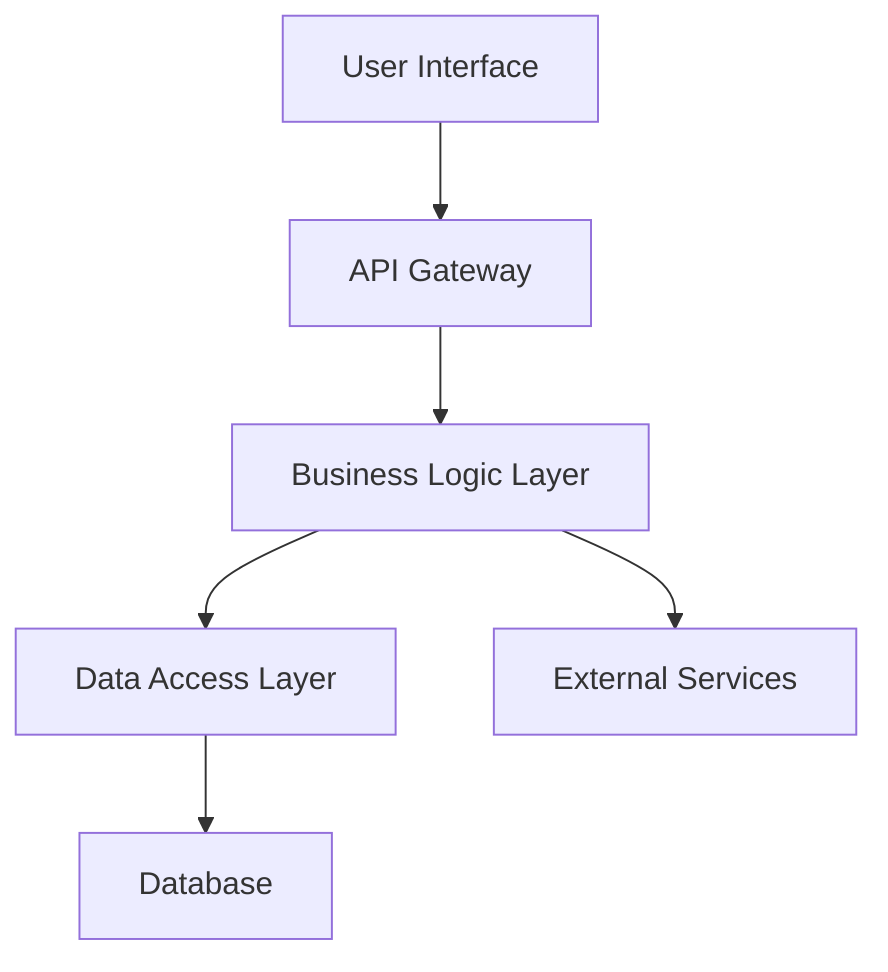
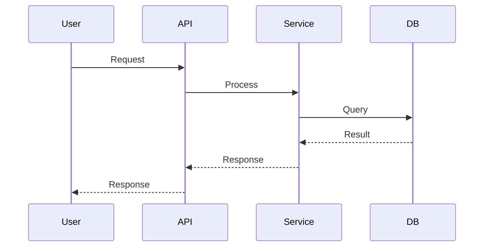
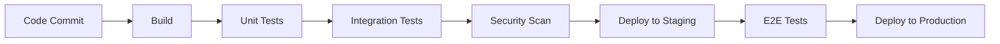

# Technical Specification: {Feature/System Name}

## Document Information
**Project:** {Project Name}  
**Version:** {Version Number}  
**Date:** {YYYY-MM-DD}  
**Author:** {Technical Lead Name}  
**Status:** Draft | Review | Approved | Implemented  
**Related PRD:** {Link to Product Requirements Document}  
**Related ADR:** {Link to relevant Architecture Decision Records}

## Executive Summary

{Brief overview of the technical solution and its key components}

### Key Technical Decisions
- {Primary technology choice}
- {Architecture pattern selection}
- {Integration approach}

### Implementation Scope
- {High-level scope of technical work}
- {Timeline estimate}
- {Resource requirements}

## Background and Context

### Problem Statement
{Technical problem being solved, including current limitations}

### Business Requirements
{Summary of business needs from PRD that drive technical requirements}

### Technical Context
- **Current Architecture:** {Description of existing systems}
- **Technology Stack:** {Current technologies in use}
- **Constraints:** {Technical, performance, or regulatory constraints}
- **Dependencies:** {External systems, services, or libraries}

## Technical Requirements

### Functional Requirements
1. **{Requirement Category}**
   - {Specific technical requirement}
   - {Data processing needs}
   - {Integration requirements}

2. **{Requirement Category}**
   - {Specific technical requirement}
   - {Business logic requirements}

### Non-Functional Requirements

#### Performance
- **Response Time:** {Target response times}
- **Throughput:** {Requests per second, data volume}
- **Scalability:** {Growth expectations}
- **Resource Usage:** {Memory, CPU, storage limits}

#### Security
- **Authentication:** {Authentication mechanisms}
- **Authorization:** {Access control requirements}
- **Data Protection:** {Encryption, PII handling}
- **Compliance:** {Regulatory requirements}

#### Reliability
- **Availability:** {Uptime requirements}
- **Error Handling:** {Error recovery strategies}
- **Monitoring:** {Observability requirements}
- **Backup/Recovery:** {Data protection strategies}

#### Maintainability
- **Code Quality:** {Standards and practices}
- **Documentation:** {Code and API documentation}
- **Testing:** {Test coverage requirements}
- **Deployment:** {CI/CD requirements}

## Solution Architecture

### High-Level Architecture



### System Components

#### Component 1: {Component Name}
- **Purpose:** {What this component does}
- **Technology:** {Implementation technology}
- **Interfaces:** {APIs, events, data flows}
- **Dependencies:** {Other components it depends on}

#### Component 2: {Component Name}
- **Purpose:** {What this component does}
- **Technology:** {Implementation technology}
- **Interfaces:** {APIs, events, data flows}
- **Dependencies:** {Other components it depends on}

### Data Architecture

#### Data Models
```sql
-- Example data schema
CREATE TABLE {table_name} (
    id SERIAL PRIMARY KEY,
    name VARCHAR(255) NOT NULL,
    created_at TIMESTAMP DEFAULT NOW()
);
```

#### Data Flow


### API Design

#### Endpoints

##### GET /api/v1/{resource}
- **Purpose:** {What this endpoint does}
- **Parameters:** 
  - `param1` (string, required): {Description}
  - `param2` (integer, optional): {Description}
- **Response:**
```json
{
  "status": "success",
  "data": {
    "id": 123,
    "name": "example"
  }
}
```

##### POST /api/v1/{resource}
- **Purpose:** {What this endpoint does}
- **Request Body:**
```json
{
  "name": "string",
  "description": "string"
}
```
- **Response:**
```json
{
  "status": "created",
  "data": {
    "id": 124,
    "name": "example"
  }
}
```

### Security Implementation

#### Authentication
- **Method:** {JWT, OAuth2, etc.}
- **Token Management:** {Storage, refresh, expiration}
- **Session Handling:** {Session management approach}

#### Authorization
- **RBAC Model:** {Role definitions}
- **Permissions:** {Permission structure}
- **Access Control:** {Implementation approach}

#### Data Protection
- **Encryption at Rest:** {Database encryption}
- **Encryption in Transit:** {HTTPS, TLS configuration}
- **PII Handling:** {Data anonymization, masking}

## Implementation Details

### Development Approach

#### Phase 1: Foundation
- [ ] {Infrastructure setup}
- [ ] {Core component development}
- [ ] {Basic API implementation}
- **Timeline:** {Duration}

#### Phase 2: Core Features
- [ ] {Feature implementation}
- [ ] {Integration development}
- [ ] {Security implementation}
- **Timeline:** {Duration}

#### Phase 3: Integration & Testing
- [ ] {System integration}
- [ ] {Performance testing}
- [ ] {Security testing}
- **Timeline:** {Duration}

### Technology Stack

#### Backend
- **Language:** {Programming language and version}
- **Framework:** {Web framework}
- **Database:** {Database technology and version}
- **Cache:** {Caching solution}

#### Frontend (if applicable)
- **Framework:** {UI framework}
- **Build Tools:** {Build and bundling tools}
- **State Management:** {State management approach}

#### Infrastructure
- **Cloud Provider:** {AWS, Azure, GCP, etc.}
- **Containers:** {Docker, Kubernetes}
- **CI/CD:** {Build and deployment pipeline}
- **Monitoring:** {Observability stack}

### Database Design

#### Schema Design
```sql
-- Core entities
CREATE TABLE users (
    id SERIAL PRIMARY KEY,
    email VARCHAR(255) UNIQUE NOT NULL,
    password_hash VARCHAR(255) NOT NULL,
    created_at TIMESTAMP DEFAULT NOW(),
    updated_at TIMESTAMP DEFAULT NOW()
);

-- Add additional tables as needed
```

#### Indexing Strategy
- **Primary Indexes:** {Key indexes for performance}
- **Composite Indexes:** {Multi-column indexes}
- **Performance Considerations:** {Query optimization notes}

#### Migration Strategy
- **Schema Changes:** {How schema updates will be handled}
- **Data Migration:** {Data transformation approach}
- **Rollback Plan:** {How to revert changes}

## Testing Strategy

### Test Pyramid

#### Unit Tests
- **Coverage Target:** {Percentage}
- **Framework:** {Testing framework}
- **Scope:** {What will be unit tested}

#### Integration Tests
- **Scope:** {Component integration testing}
- **Test Data:** {Test data management}
- **Environment:** {Testing environment setup}

#### End-to-End Tests
- **Critical Paths:** {Key user journeys}
- **Automation:** {E2E testing framework}
- **Performance Tests:** {Load testing approach}

### Test Environments
- **Development:** {Local development testing}
- **Staging:** {Pre-production testing}
- **Production:** {Production monitoring}

## Deployment Strategy

### Deployment Pipeline



### Infrastructure

#### Development Environment
- **Setup:** {Local development configuration}
- **Dependencies:** {Required services and tools}
- **Data:** {Development data strategy}

#### Production Environment
- **Hosting:** {Cloud provider and services}
- **Scaling:** {Auto-scaling configuration}
- **Monitoring:** {Observability and alerting}
- **Backup:** {Data backup and recovery}

### Release Process
1. **Code Review:** {Review requirements}
2. **Testing:** {Required test execution}
3. **Staging Deployment:** {Staging validation}
4. **Production Deployment:** {Deployment procedure}
5. **Post-Deployment:** {Monitoring and validation}

## Risk Assessment and Mitigation

### Technical Risks

#### High Priority Risks
- **Risk:** {Description of technical risk}
  - **Impact:** {Potential consequences}
  - **Probability:** High | Medium | Low
  - **Mitigation:** {Specific mitigation strategy}
  - **Contingency:** {Backup plan}

#### Medium Priority Risks
- **Risk:** {Description of technical risk}
  - **Impact:** {Potential consequences}
  - **Mitigation:** {Specific mitigation strategy}

### Dependencies and External Risks
- **Third-party Services:** {Service dependencies and risks}
- **Infrastructure:** {Cloud provider risks}
- **Team Dependencies:** {Resource availability risks}

## Monitoring and Observability

### Metrics and KPIs
- **Performance Metrics:** {Response time, throughput}
- **Business Metrics:** {User engagement, conversion}
- **System Health:** {Error rates, availability}

### Logging Strategy
- **Log Levels:** {Debug, info, warn, error}
- **Structured Logging:** {JSON format, fields}
- **Log Aggregation:** {Centralized logging solution}

### Alerting
- **Critical Alerts:** {System down, high error rates}
- **Warning Alerts:** {Performance degradation}
- **Notification Channels:** {Slack, email, PagerDuty}

## Maintenance and Support

### Operational Procedures
- **Deployment:** {Standard deployment process}
- **Rollback:** {How to revert deployments}
- **Scaling:** {How to handle load increases}
- **Incident Response:** {On-call procedures}

### Documentation
- **API Documentation:** {OpenAPI/Swagger specs}
- **Runbooks:** {Operational procedures}
- **Architecture Docs:** {System documentation}

### Support Model
- **Level 1 Support:** {Basic troubleshooting}
- **Level 2 Support:** {Technical investigation}
- **Level 3 Support:** {Development team involvement}

## Appendices

### Appendix A: API Specifications
{Detailed API documentation or links to OpenAPI specs}

### Appendix B: Database Schema
{Complete database schema and documentation}

### Appendix C: Configuration Examples
{Sample configuration files and deployment scripts}

### Appendix D: External References
{Links to vendor documentation, industry standards, etc.}

---
*Template Version: 1.0*  
*Last Updated: {Date}*  
*Next Review: {Date}*
